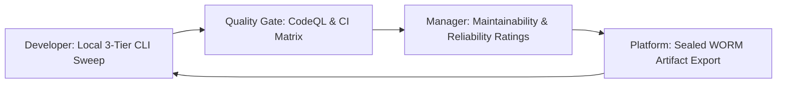

# Reismannpoint Observatorium: Code Quality & Continuous Improvement Policy

## 1. Quality Architecture Matrix
Reismannpoint Observatorium utilizes a 2-tier rating matrix aligned with GitHub Code Quality standards:

| Rating Metric | Quality Focus | Verification Mechanism |
| :--- | :--- | :--- |
| **Maintainability** | Dead code elimination, cyclomatic complexity reduction, documentation completeness | `master_all_engines_sweep.py` & CodeQL |
| **Reliability** | Mathematical correctness, physical bounds ($v_E \le c$), error handling, zero unhandled exceptions | `SOFTWARE_PASS`, `MODEL_PASS`, `EVIDENCE_PASS` |

## 2. The 3-Role Continuous Improvement Cycle

### A. For Developers:
- Run `observatorium sweep` locally before submitting pull requests.
- Ensure 100% pass across `SOFTWARE`, `MODEL`, and `EVIDENCE` tiers.

### B. For Engineering & Research Leaders:
- Monitor CI artifacts (`observatorium_3tier_report.json`) across Python 3.10–3.12 matrices.
- Enforce strict fail-closed interlocks (`KILL` / `HOLD`) on non-admissible candidate states.

### C. For Platform Administrators:
- Maintain manifest SHA-256 forsegling for every release commit.
- Keep GitHub Actions workflow pipelines 100% green.
