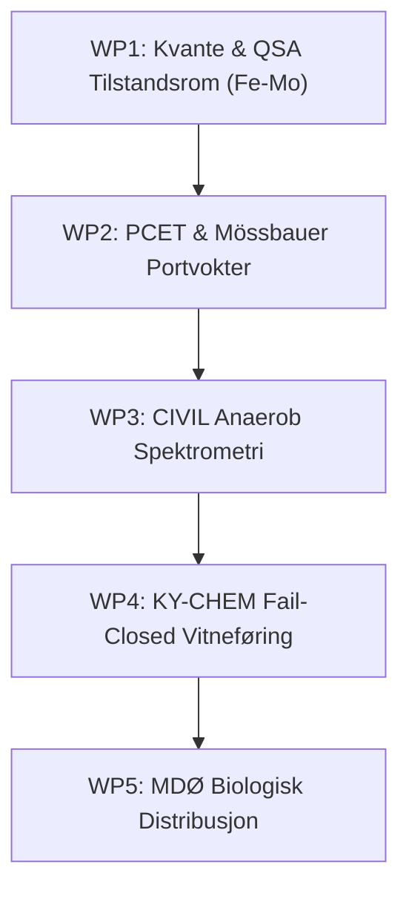

# Forskningsprogram: Biomimetisk Fe-Mo-S Nitrogenase & Kjemisk Realiseringsgrammatikk

**Status:** PROPOSED // INITIATION  
**Dato:** 27. juli 2026  
**Arkitektur:** Fail-Closed Realiseringsgrammatikk (KY-CHEM / ATLAS / Phronesis)  

---

## 1. Visjon og Hovedmål

Dette forskningsprogrammet har som mål å utvikle en **teoretisk, numerisk og fail-closed kontrollramme** for biomimetiske Fe-Mo-S klynger (analogt til nitrogenase-enzymets aktivsetekompleks FeMoCo). Programmet forener kvantemekanisk tilstandsrommodellering, Proton-Coupled Electron Transfer (PCET), Mössbauer-spektrometri og stram portvokterkontroll for å muliggjøre trygg, støyfri katalytisk analyse uten risiko for uønskede kjemiske avvik.

---

## 2. Arbeidspakker (Work Packages)

### WP1: Kvantemekanisk & Tilstandsrommodellering (QSA Fe-Mo)
* **Fokus:** Videreutvikling av den 15-tilstands kvantemodellen (\(N_{\text{state}} = 15, N_{\text{ctrl}} = 6\)) for Fe-Mo-S klynger.
* **Oppgaver:**
  * Optimalisere Riccati-basert \(H_\infty\) LQR-kontrolldesign for å motvirke parasittisk \(ZZ\)-kobling (\(\zeta_{zz} = 2\pi \times 50\text{ kHz}\)) og kvantedekohærens (\(T_1 = 50\ \mu\text{s}, T_2 = 30\ \mu\text{s}\)).
  * Sikre stabil matrikskondisjonering (\(\text{cond}(V)\)) og minimere transient vekst under regimeskifte (Nominal \(\rightarrow\) Thermal \(\rightarrow\) Shock).
  * Implementere Q24 fastpunkts-skalering for integrasjon på FPGA/embedded maskinvare.

### WP2: PCET & Mössbauer Portvokterkontroll (`femos_control_loop`)
* **Fokus:** Automatisk avskjæring og klassifisering av biomimetiske kandidater.
* **Oppgaver:**
  * **KIE-Gate:** Håndheve Kinetic Isotope Effect-grenser (\(2.0 \le \text{KIE} \le 7.0\)) for å verifisere gyldig PCET-mekanisme og stoppe uønsket kvantetunnelering.
  * **Mössbauer Isomerskift (\(\Delta\delta\)):** Presis kartlegging av elektronfordeling i Fe-klyngen (fra *Isometric null zone* til *Global electron drain*).
  * **Ytelses- & Perturbasjonsport:** Krav til Faradaic Efficiency (\(FE \ge 0.85\)), overpotensialforbedring (\(\Delta E \ge 100\text{ mV}\)) og 30s perturbasjonsgjenoppretting (\(\le 0.05\)).

### WP3: Anaerob Spektrometri & Atlas Pipeline Integrasjon
* **Fokus:** Miljøkontroll og antropocen støyeliminering.
* **Oppgaver:**
  * Implementere `CivilMossbauerValidator` med stramme fastpunktskrav (\(\delta = 0.8\text{ mm/s}\), \(O_2 < 0.5\text{ ppm}\), \(NH_3 = 0.0\text{ ppm}\)).
  * Integrere 4-lags Atlas-pipeline: Spektralkontroll \(\rightarrow\) Divergensanalyse (\(\text{The Fork}\)) \(\rightarrow\) Det Tredje Rommet (Hamilton-regulator \(H_\phi\)) \(\rightarrow\) WORM Commit.

### WP4: Fail-Closed KY-CHEM Realiseringsgrammatikk & Vitneføring
* **Fokus:** Fysisk og digital sikkerhetsinnramming.
* **Oppgaver:**
  * Etablere klar demarkasjon: Papirberegninger og tørre nomogrammer = `OPEN`; Fysisk syntese, dosering eller reaksjonsstyring = `KILL`.
  * Utvikle et dobbelt vitnesbyrd (\(W^2\)) via fysiske/digitalt pregede kort for å forhindre historisk mutasjon av kjemiske beslutninger.

### WP5: Biologisk Analogi & Desentralisert Nettverkskontroll (MDØ)
* **Fokus:** Skalering via Mycelium-inspirerte distribuerte nettverk.
* **Oppgaver:**
  * Modellere lokal ressursfluks (\(\Phi\)) og strukturell siling (\(\Pi_K\)) over distribuerte hyfenettverk.
  * Håndheve kapasitetsgrenser (\(K_C = [0,100]\)) og absorberende metningsbelter.

---

## 3. Milepæler og Valideringskriterier

| Milepæl | Tidslinje | Kriterium for Godkjenning | Status |
| :--- | :--- | :--- | :--- |
| **M1: QSA-Modellering** | Q3 2026 | Full spektralradiesjekk (\(\rho < 1.0\)) i alle tre regimer | Planlagt |
| **M2: Portvokter-validering** | Q4 2026 | 100% fail-closed avskjæring på ugyldige KIE/Mössbauer-kandidater | Utkast |
| **M3: Anaerob Pipeline** | Q1 2027 | SHA-256 forsegling for Kanonisk Denotasjon under \(O_2 < 0.5\text{ ppm}\) | Planlagt |
| **M4: WORM Vitneforsegling** | Q2 2027 | Fysisk/digitalt dobbeltvitne (\(W^2\)) verifisert | Utkast |

---

## 4. Etikk og Sikkerhetsreglement (Fail-Closed Governance)

> [!IMPORTANT]
> **Kanonisk regel for forskningsprogrammet:**  
> Programmet skal utelukkende operere innenfor tørr beregning, kvantesimulering, nomogram-klassifisering og teoretisk modellering (**`OPEN`**). Ethvert forsøk på autonom kobling mot fysiske aktuatorer, dosering eller reell kjemisk syntese utløser umiddelbart et uomstøtelig **`KILL`**.
