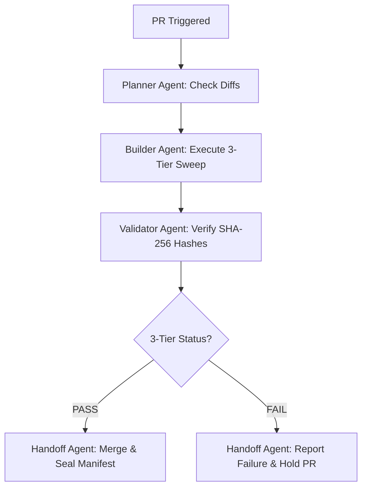

# 🤖 Agentic Workflow Specification: Reismannpoint Observatorium

This Markdown document defines the automated agentic workflow governing PR reviews, 3-tier precision verification, and evidence sealing across `femos-biomimetic-nitrogenase` and `gscx-battery-energy-network`.

## 1. Trigger Conditions
- **Event:** `pull_request` (opened, synchronized, reopened)
- **Event:** `push` on `main` branch
- **Event:** `schedule` (cron: `0 */6 * * *` - Every 6 hours)

## 2. Agent Team Archetypes & Roles

| Agent Role | Responsibilities | Tools Allowed |
| :--- | :--- | :--- |
| **Planner Agent** | Parses pull request diffs, checks architectural compliance, sets execution plan | `list_directory`, `view_file` |
| **Builder Agent** | Executes 3-tier precision verifications and updates manifest SHA-256 | `run_command`, `replace_file_content` |
| **Validator Agent** | Runs independent hash re-computation and verifies Landauer entropy bounds | `mcp_observatorium_server` |
| **Handoff Agent** | Synthesizes summary, comments on PR, and seals WORM evidence | `git_commit`, `github_pr_comment` |

## 3. Execution Pipeline

## 4. Verification Policy
- **`SOFTWARE_PASS`**: Exit code 0, 0 unhandled exceptions.
- **`MODEL_PASS`**: Gate verdicts admissible (`OPEN`, `LATCH`, `CONVERGE`, `REALIZED`).
- **`EVIDENCE_PASS`**: Cryptographic SHA-256 witness hash independently re-computed.
